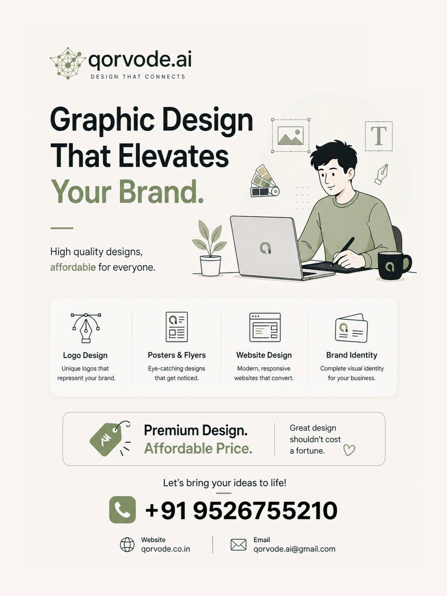

<div align="center">

# Sayyid Rafid Al Hadi

### Full-Stack Developer & Vocalist

[](https://github.com/Cybertechyrappu)
[](https://qorvode.co.in/)
[](https://opensource.org/licenses/MIT)

---

<p align="center">
  <b>Available for Selective Partnerships · 2026</b>
</p>

[Explore My Work](#-selected-works) • [View The Arsenal](#-the-arsenal) • [Initialize Protocol](#-initialize-protocol)

</div>

---

## Design. Development. Digital Authority.

We build premium digital experiences that transform brands into industry leaders. High-ticket solutions for serious businesses.

---

## The Experience

This isn't just a website — it's a high-performance 3D environment built entirely on **Android** via **Spck Editor**.

- **Immersive 3D:** Powered by `Three.js` with hardware-accelerated WebGL rendering.
- **Hacker Aesthetic:** Dynamic "Hacker Text" decoding animations and translucent glassmorphism UI.
- **Fluid Motion:** Motion-driven scroll triggers and a liquid-glow background that follows user interaction.
- **Encrypted Transmission:** Fully functional contact portal powered by `EmailJS`.
- **Anti-Inspect Protocol:** Hardened against unauthorized code inspection and debugging.

---

## The Arsenal

I leverage a diverse tech stack to build, test, and secure digital assets.

### Development

- **Full-Stack Architecture:** Scalable, high-performance web applications using Next.js, React, Tailwind, and Firebase.
- **Vocal Production:** Composing, writing, and tracking resonant vocal performances and lyrics with professional fidelity.
- **Immersive 3D UI:** Three.js and GSAP for fluid motion, WebGL, and glassmorphism that keeps users deeply engaged.
- **Mobile-First Dev:** Production-grade apps built entirely on Android — Spck Editor, Kotlin, no desktop required.

### Tech Stack


---

## Services

I offer premium digital services tailored to elevate your brand.




### Premium Web Development — From $499

- Bespoke High-Performance Websites
- 3D Immersive Experiences
- React & Next.js Expert
- Mobile-First Design
- SEO-Optimized

### Mobile App Development — From $699

- Android Apps Built on Android
- Flutter & Kotlin
- PWA Development
- Play Store Deployment
- App Maintenance

### Brand Identity Design — From $299

- Logo Design
- Brand Guidelines
- Visual Identity Systems
- Typography & Color
- Brand Strategy

### Islamic Audio Production — From $199

- Nasheed Composition
- Vocals & Lyrics
- Professional Mixing
- Mastering
- Rights Management

---

## Selected Works

### Kithademic Studies
> *Knowledge is the light of the heart. Excellence in Islamic & Academic Education.*

- **Core:** A professional education platform bridging Islamic values with modern academics.
- **Tech:** Next.js, Tailwind CSS, Vercel deployment
- **Status:** In Progress — [Live Preview](https://kithademic.vercel.app)

### KPS Ayurveda Clinic
> *Heal Through Ayurveda — Authentic Care for Holistic Wellness.*

- **Core:** Schedule your personalized Ayurvedic consultation today.
- **Tech:** Next.js, Tailwind CSS, Vercel deployment
- **Status:** In Progress — [Live Preview](https://kpsayurvedaclinic.vercel.app/)

### HalalTune
> *Islamic Audio Streaming PWA*

- **Core:** A Spotify-tier Islamic audio streaming PWA — built entirely from an Android phone. Firebase backend, Cloudinary CDN, Cache API offline playback, full playlist system, and admin dashboard.
- **Tech:** PWA, Firebase, Cloudinary
- **Status:** Beta — [Live Preview](https://halaltune.vercel.app)

---

## Music & Releases

### Wail Of The End
Nasheed — All vocals, lyric writing, and composition by Sayyid Rafid Al Hadi.

### Fajr-al-Islam
Nasheed — Blending tradition with modern vocals.

---

## Terminal Output

```
qorvode@authority:~$ ./accelerate_growth
> Analyzing market positioning...
> Optimizing conversion architecture...
> Scaling digital authority...
> Status: Premium Experience Online. ✓
```

---

## FAQ

**What is your primary development stack?**
I specialize in modern web and mobile technologies — Next.js, React, Tailwind CSS, TypeScript, Firebase, and Three.js for immersive 3D interfaces. I build everything mobile-first.

**Do you write and compose your own music?**
Yes. For releases like 'Wail Of The End' and 'Fajr-al-Islam', I handle all vocals, lyric writing, and composition. My music draws from Islamic heritage and modern production.

**Are the Kithademic and KPS projects live?**
Both are in active development with live preview deployments on Vercel. Click the project links above to explore them.

**Open to collaboration?**
Absolutely. Whether it's development, audio collaboration, or a hybrid creative project — use the contact form below and let's build something extraordinary together.

---

## Initialize Protocol

Ready to start a project or discuss collaboration? Let's connect.

- **Website:** [https://qorvode.co.in/](https://qorvode.co.in/)
- **Email:** qorvode.ai@gmail.com
- **GitHub:** [https://github.com/Cybertechyrappu](https://github.com/Cybertechyrappu)

Trusted by visionary founders & premium brands.

---

<div align="center">
  
</div>